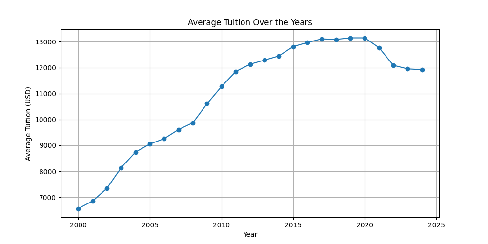
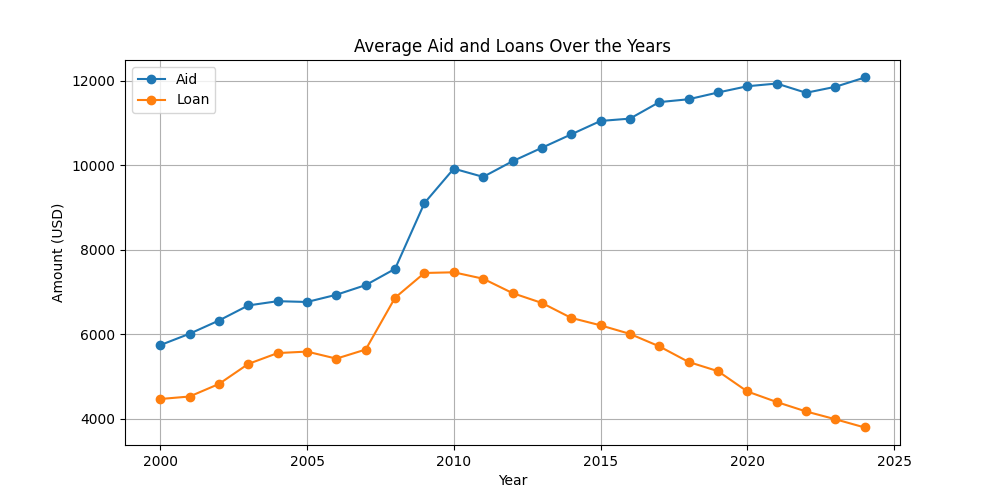
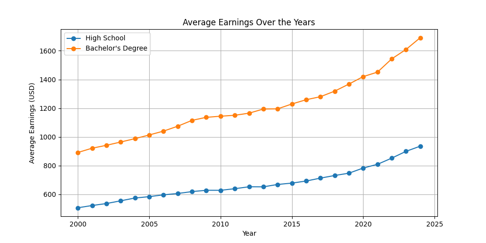
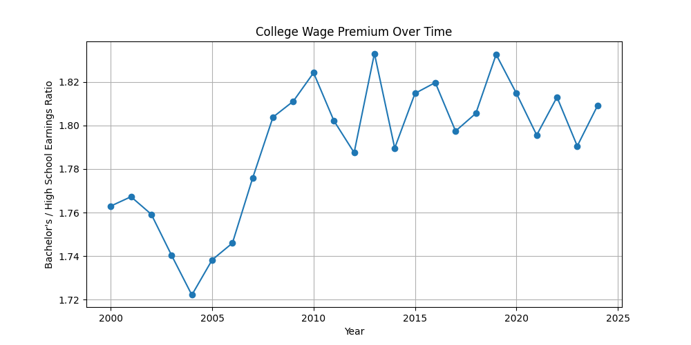

# Education Track

## Question/Proposal: The Cost of College Has Risen. Has Financial Return Kept Up?

# Setup
This project uses Python 3.14 along with the following libraries:
- pandas  
- matplotlib  
- urllib (built-in)

Install the required external libraries using:

```python
pip install pandas matplotlib
```

Project Structure
We use three separate Python files for a clean workflow:
- setup.py → Fetches datasets from the web
- cleanup.py → Cleans and processes the data
- visualization.py → Creates graphs and analysis


We use Python’s built-in urllib library to download datasets directly from online sources.
Import urllib as follows:

```python
import urllib.request as urllib;
```

Then use the following script to download all required datasets:

```python
# Bachelor's earnings data
urllib.urlretrieve(
    "https://fred.stlouisfed.org/graph/fredgraph.csv?id=LEU0252918500Q",
    "ba_earnings.csv"
)

# High school earnings data
urllib.urlretrieve(
    "https://fred.stlouisfed.org/graph/fredgraph.csv?id=LEU0252917300Q",
    "hs_earnings.csv"
)

# Tuition data
urllib.urlretrieve(
    "https://research.collegeboard.org/media/xlsx/Trends-in-Student-Aid-2025-excel-data_0.xlsx",
    "tuitions.xlsx"
)

# Aid and loan data
urllib.urlretrieve(
    "https://research.collegeboard.org/media/xlsx/Trends-in_College-Pricing-2025-excel-data.xlsx",
    "loans_and_grants.xlsx"
)
```

This script: 
- Downloads datasets directly from FRED (Federal Reserve Economic Data) and College Board
- Saves them locally as .csv and .xlsx files
- Prepares raw data for the cleanup stage

# Data Clean-up
We use pandas library for cleaning up data.

Before you begin, make sure to import the libraries:

```python
import pandas as pd
```

Ensure these libraries are installed using:

```python
pip install pandas matplotlib
```

The following script processes raw datasets, extracts relevant columns, converts dates, and aggregates yearly data:

```python
import pandas as pd

# Tuition Data
file_path = "tuitons.xlsx"
tuition_df = pd.read_excel(file_path, sheet_name="Table CP-2")
tuition_df_clean = tuition_df.iloc[31:56, [0,3]]
tuition_df_clean.columns = ["year", "tuition"]

# Aid and Loan Data
file_path = "loans_and_grants.xlsx"
aid_loan_df = pd.read_excel(file_path, sheet_name="Table SA-3")
aid_df_clean = aid_loan_df.iloc[66:91, [0,5,7]]
aid_df_clean.columns = ["year", "aid", "loan"]
aid_df_clean["aid"] = aid_df_clean["aid"].round(0).astype(int)
aid_df_clean["loan"] = aid_df_clean["loan"].round(0).astype(int)

# High School Earnings
file_path = "hs_earnings.csv"
hs_earnings_df = pd.read_csv(file_path)
hs_earnings_df = hs_earnings_df.iloc[:100, [0,1]]

# Bachelor's Earnings
file_path = "ba_earnings.csv"
ba_earnings_df = pd.read_csv(file_path)
ba_earnings_df = ba_earnings_df.iloc[:100, [0,1]]

# Convert to datetime
tuition_df_clean["year"] = pd.to_datetime('20' + tuition_df_clean["year"].str[:2])
aid_df_clean["year"] = pd.to_datetime(aid_df_clean["year"].str[:4])
hs_earnings_df["observation_date"] = pd.to_datetime(hs_earnings_df["observation_date"])
ba_earnings_df["observation_date"] = pd.to_datetime(ba_earnings_df["observation_date"])

# Group by year (annual averages)
tuition_annual = tuition_df_clean.groupby(tuition_df_clean["year"].dt.year)["tuition"].mean().reset_index()
aid_annual = aid_df_clean.groupby(aid_df_clean["year"].dt.year)[["aid", "loan"]].mean().reset_index()
hs_annual = hs_earnings_df.groupby(hs_earnings_df["observation_date"].dt.year)["LEU0252917300Q"].mean().reset_index()
ba_annual = ba_earnings_df.groupby(ba_earnings_df["observation_date"].dt.year)["LEU0252918500Q"].mean().reset_index()

# Rename columns
hs_annual.columns = ["year", "hs_earnings"]
ba_annual.columns = ["year", "ba_earnings"]

# Save cleaned data
hs_annual.to_csv("hs_earnings_clean.csv", index=False)
ba_annual.to_csv("ba_earnings_clean.csv", index=False)
tuition_annual.to_csv("tuition_clean.csv", index=False)
aid_annual.to_csv("aid_and_loans_clean.csv", index=False)
```

This script:
- Extracts relevant rows and columns from raw datasets
- Cleans and formats numeric values
- Converts date fields into proper datetime format
- Aggregates quarterly data into yearly averages
- Outputs clean CSV files for visualization


# Visualizations

## 1. Tuition Trends


This graph shows how average college tuition has increased steadily over time.

---

## 2. Financial Aid vs Loans


While financial aid has increased, student loans have also risen significantly, indicating growing reliance on borrowing.

---

## 3. Earnings Comparison


Bachelor’s degree holders consistently earn more than high school graduates over time.

---

## 4. College Wage Premium


This graph shows the ratio of bachelor’s earnings to high school earnings, representing the “college advantage.”

# Trends

Overall, while the cost of college has risen sharply, the wage premium has remained relatively stable, raising questions about whether the financial return justifies the increasing cost.
